# Azure-VM-PowerShell-Lab
This lab demonstrates deploying and connecting to an Azure Virtual Machine using **PowerShell CLI**.

## 🔹 Lab Overview

In this lab, I performed the following tasks:
1. Authenticated to Azure via PowerShell.
2. Created a Resource Group.
3. Created a Virtual Machine with proper networking and security configurations.
4. Connected to the VM via RDP.

---

## Screenshots  

0. 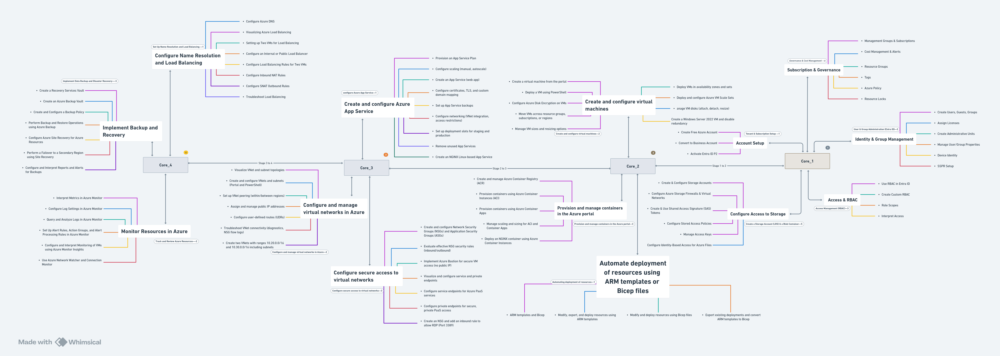  
1. 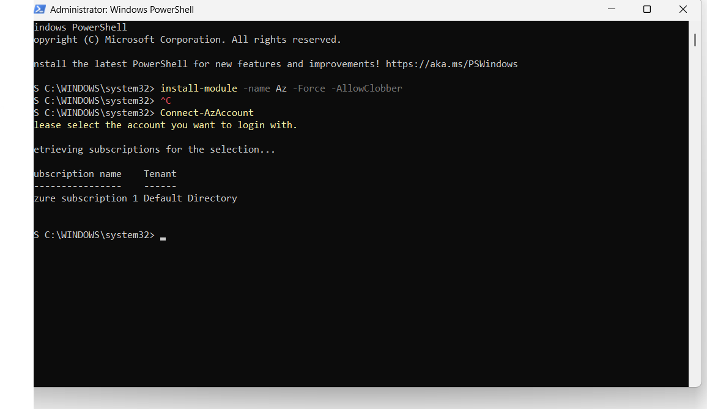  
2. 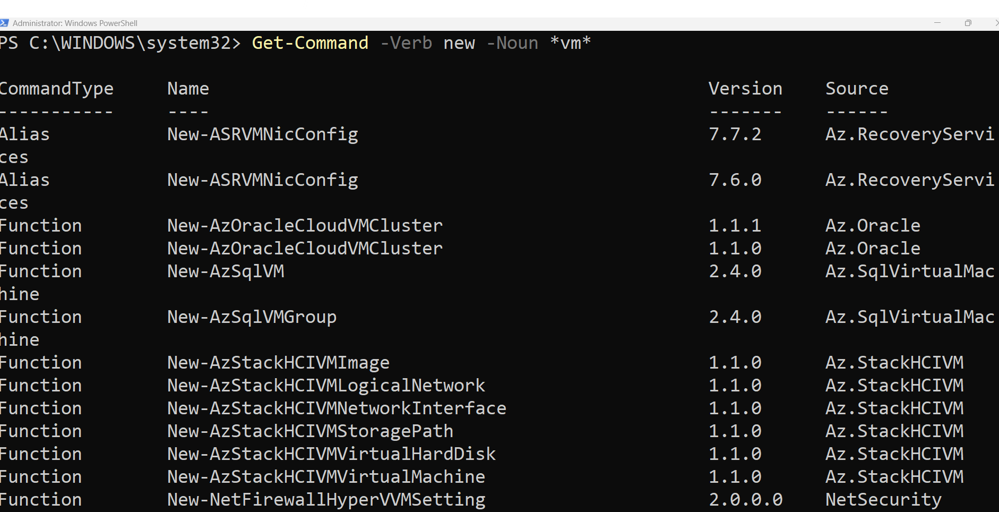  
3. 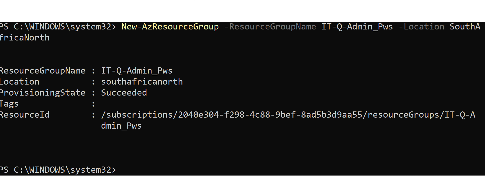  
4. 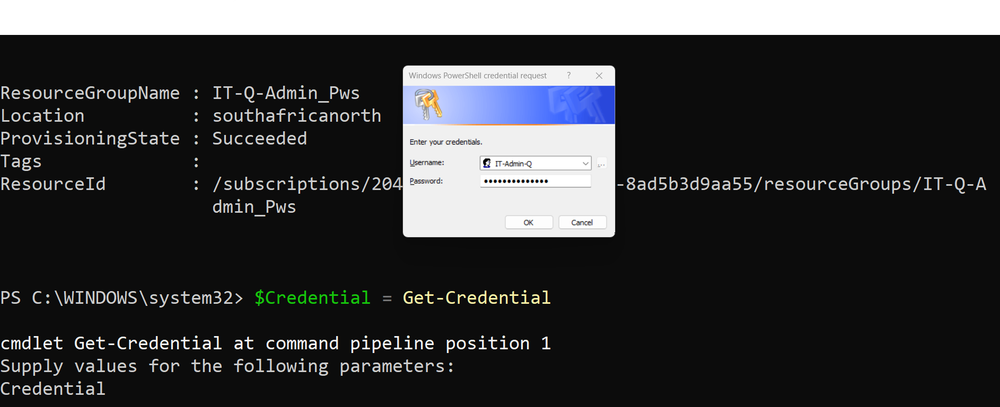  
5. 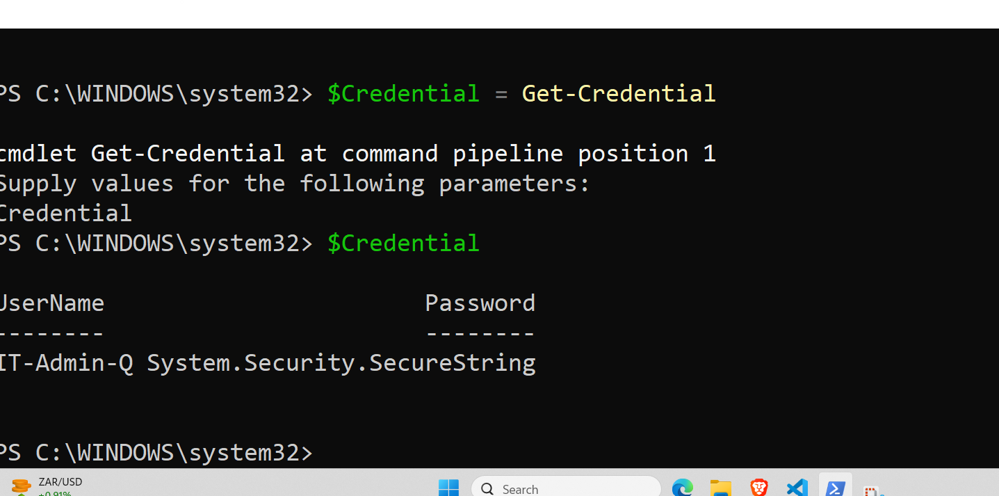  
6. 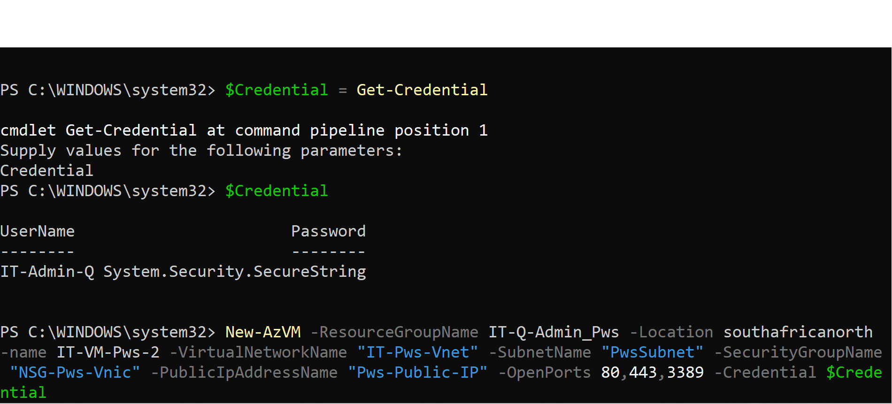  
7. 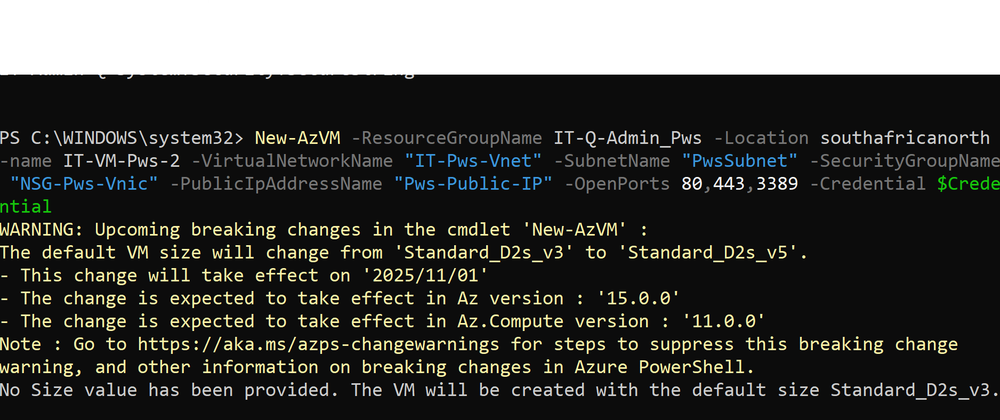  
8. 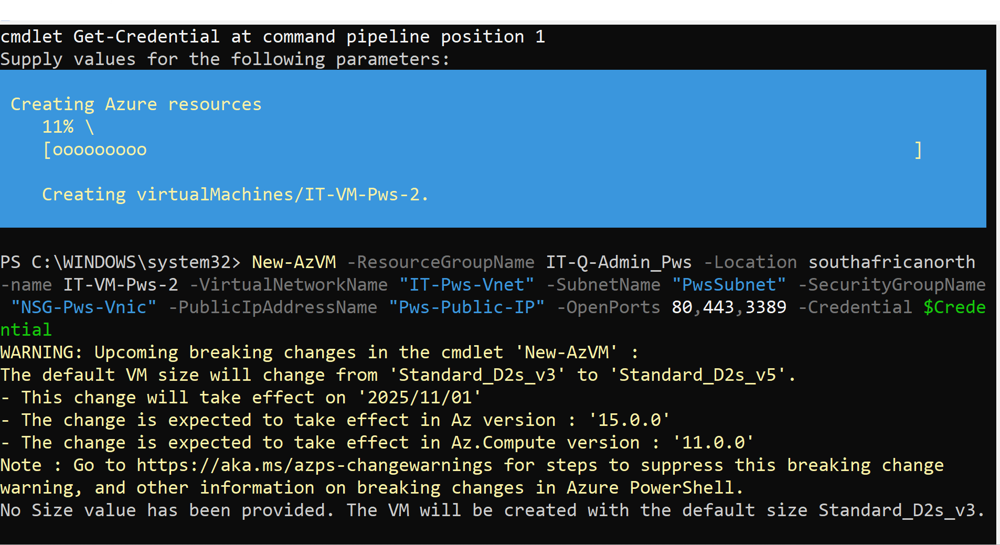  
9. 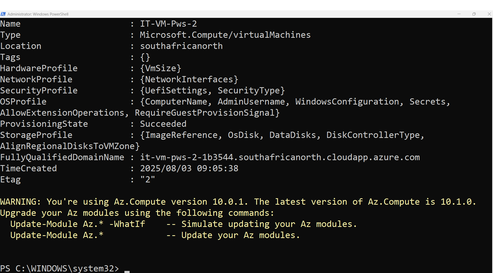  
10. 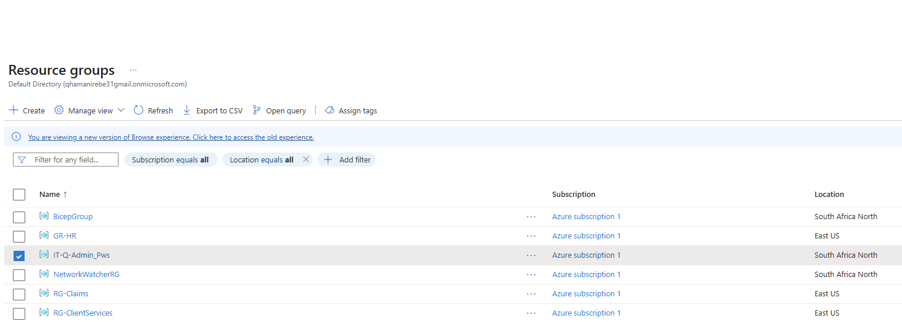  
11. 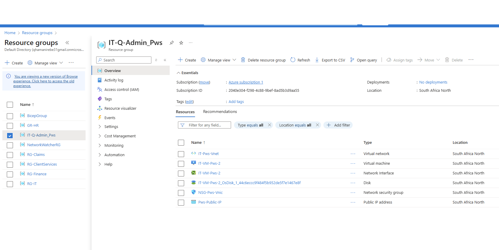  
12. 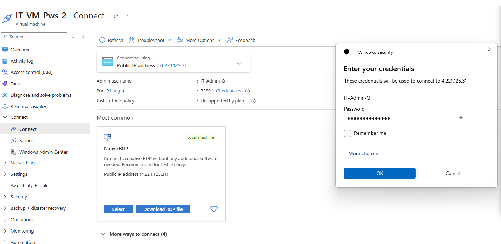  
13. 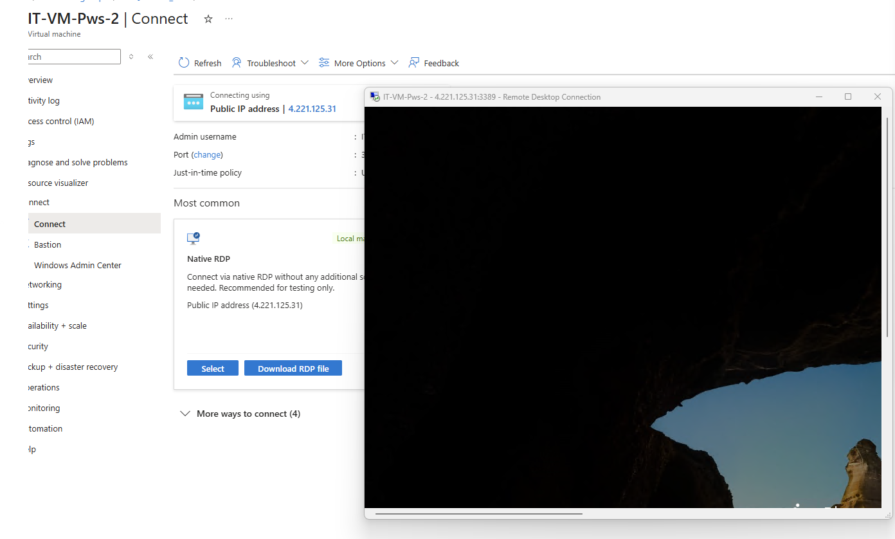  


## 🔹 Commands and Explanation

### 1️⃣ Connect to Azure
```powershell
Connect-AzAccount
Explanation: Authenticates your PowerShell session with Azure, allowing you to manage Azure resources using your credentials.

New-AzResourceGroup -Name VMPowerShellDemo -Location EastUS
Explanation: Creates a new Azure Resource Group named VMPowerShellDemo in the East US region to group related resources.

Import-Module Az
Explanation: Loads the Az module into your PowerShell session, enabling you to use cmdlets for managing Azure resources.

New-AzVM -ResourceGroupName VMPowerShellDemo -Location EastUS -Name MyVM -VirtualNetworkName "VMPowerShellVNET" -SubnetName "DefaultPowerShellSub" -SecurityGroupName "nsgPowerShellVNic" -PublicIpAddressName "PowerShellPIP" -OpenPorts 80,443,3389 -Credential $cred

Explanation: Creates a new VM named MyVM in the VMPowerShellDemo resource group and East US region.

Assigns the VM to a virtual network, subnet, network security group, and public IP.

Opens ports 80 (HTTP), 443 (HTTPS), and 3389 (RDP).

Uses $cred variable for admin credentials.


